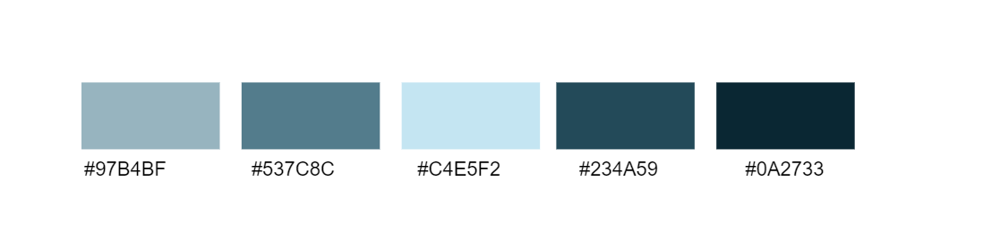

# Charte graphique
**La charte graphique, dont la dénomination correcte est cahier des normes graphiques, est un document de travail qui contient l'ensemble des règles fondamentales d'utilisation des signes graphiques qui constituent l'identité graphique d'une organisation, d'un projet.**

## le logo
**CNMH :** <br>


## les couleurs
**Source :** [Adobe color](https://color.adobe.com/fr/create/color-wheel) <br>
**Règle :** Monochrome de couleur #C4E5F2<br>
**Arrière-plan :** *Blanc* à cause des diagrammes UML <br>
```
#97B4BF
#537C8C 
#C4E5F2 
#234A59 
#0A2733 	
```

## Palette des couleurs


  ## Les fontes
- **Arial** ( pour les textes ) : 
Mercury is the closest planet to the Sun and the smallest one in the Solar System—it’s only a bit larger than our Moon.<br>

- **STAATLICHES** ( pour les titres )
Mercury is the closest planet to the Sun and the smallest one in the Solar System—it’s only a bit larger than our Moon.

### Exemple


	  

